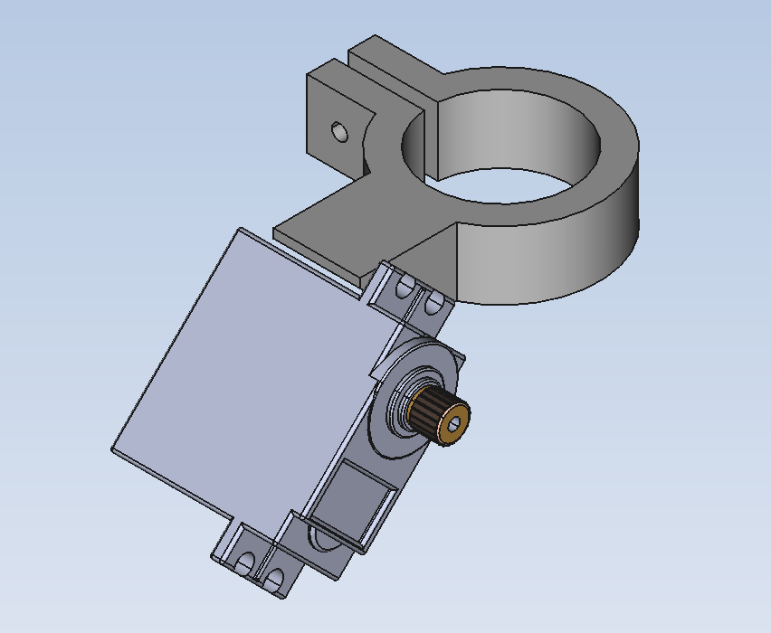
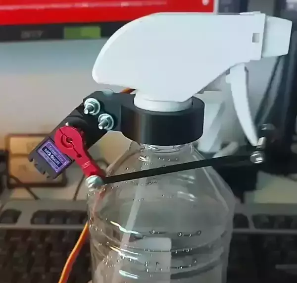
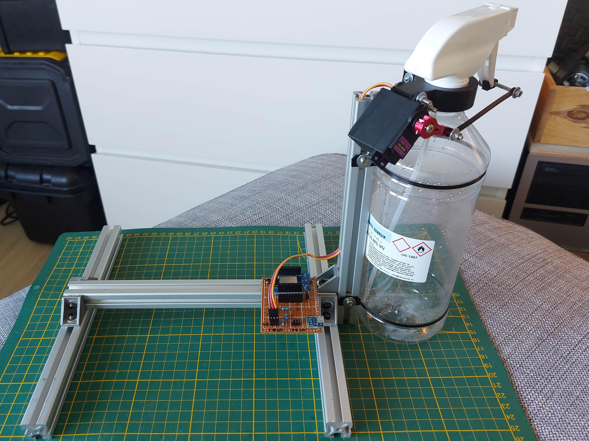

# Mister automatic
An automated approach to misting my mushroom farm

## Introduction
For my birthday this year, I've received my own mushroom farm. 
This farm starts out as a block of mycelium but promises to turn into edible mushrooms in approximately 10 days. 
In order to do so, the mycelium should first be submersed in water for a couple of hours and misted twice a day until the mushrooms are ready. 
When starting this farm I completely forgot my upcoming 4 days away from home, which would most likely mean my mushroom farm would dry out.

Since it was too late to postpone the farm, a different solution had to be found to mist my mushrooms whilst I was away from home. 
Furthermore a solution had to be found and created within 4 days so there was no time to order new components.

## Design
The biggest problem was the amount of force required to activate the spray nozzle. The motor must obviously have enough torque but at the same time, the bottle should not move when the motor is activated.

Speaking of activation: this system should mist my mushrooms twice a day and each time it activates a couple of 'pumps' are required.
Preferably, there would also be a feedback to the user like emails or notifications to existing home automation sytems.
To obtain this behaviour, a wifi enabled microprocessor is required along with a small pcb to manage power distribution.

This problem is therefore divided into thre separate issues: 
- Selecting a sufficiently strong motor
- Designing a robust, preferably self-supporting system
- Controlling the system

At the end of this section, a proof of concept is evaluated. 

### Motor
To solve the first issue, the MG996R servo motor was used; a high torque metal gear servo. Although this motor has sufficient torque (11kg/cm @ 6V), it can draw up to 2.5A of current.

The servo horn I had available is a metal arm with a maximum arm of 2.5cm, reducing the max torque to 4.4kg.
A quick test using a portable luggage scale was performed to verify if this would be enough. 
Since approximately 2 kg is required to fully retract the spray nozzle arm, the combination of the MG996R servo motor and 2.5cm servo horn should be strong enough.

Besides the 6V stall torque, the 4.8V stall torque was also specified by the manufacturer: 9.4kg/cm.
Using a 5V source and the same 2.5cm servo horn should still result in a max torque of ~3.8kg. 

This is very usefull information since I don't have any 6V sources which can supply up to 2.5A laying around but I do have many 5V usb chargers which can easily handle up to 3A.

### CAD
The second problem had to be solved using CAD. To prevent the bottle moving when spraying, the force used to activate the spray had to come from a part which is attached to the spray head but does not move during spraying.
By manually spraying a bit, I figured the most sturdy part which satisfies above demands would be the screwcap of the bottle.

The body of the system was thus designed to mimic how a human holds the spray bottle but with some attachements added for the selected servo motor. 
The image below shows the assembly of the cad model and the servo motor.

In order to attach the servo horn to the spray lever, a small clip which just snaps onto said lever and an arm to couple the clip to the servo horn was designed as well. 
These models are not explicitly shown in this section but will be visible in later pictures.

### Controller
The controller consists of a ESP8266 based development board: the WEMOS D1 mini, a power distribution and a level shifter. 
The WEMOS D1 is a microctonroller with integrated wifi functionallity and functions as the brains of the system. 
It will send a signal to the servo when the motor must be activated. 
To ensure compatibillity, a level shifter has been put in between.
This shifts the 3.3V control signal to 5V, which is the supply voltage of the servo motor and also provides any drive current required. 

#### Power distribution
Although the WEMOS module has a 5V output, this pin can unfortunately not be used to power the servo motor. 
This is due to the schottky diode which is soldered in series with the usb input of the WEMOS: it can only handle up to 500mA continuously before releasing its magic smoke. 
Experiments using the servo motor have shown that it will easily exceed this maximum under load.
To prevent the schottky from burning through, a power distribution has been added:
- A micro USB connector is added for power input
- This power input is directly connected to the power supply pin of the servo motor and the '+' pins of the headers.
- The power input is connected to the 5V pin of the WEMOS module via a 'regular' 1N4001 diode.

Diode D1 is added to prevent the shottky diode on the WEMOS module from burning when the module is plugged into the computer. 
During programming the 5V pin of the module is attached to the usb power, without D1, the servo motor would become powered as well.
When power is supplied via J1 (the micro usb for power input) approximatley 4.3V is applied to the 5V pin.
This 5V pin is internally connected to a low dropout regulator with a maximum dropout voltage of 0.5V at full load
[[WEMOS D1 Mini schematic](https://www.wemos.cc/en/latest/_static/files/sch_d1_mini_v3.0.0.pdf), [LDO datasheet](https://datasheet.lcsc.com/szlcsc/Nanjing-Micro-One-Elec-ME6211C33M5G-N_C82942.pdf)].
Since the difference of input vs output voltage for this LDO is well above the dropout voltage, the 3.3V line of the WEMOS module will not be negatively affected by diode D1.

<!-- TODO add firmware description -->

### Proof of concept
As a proof of concept, the designed models were printed and attached to the spray head of the bottle.
The controller was assembled on a breadboard, power was supplied by a controllable power supply.

The design functioned as intended and the maximum measured current draw was around 1.6A.

Issues requiring attention were:
1. Collision of the servo horn with the servo body
2. The nut attaching the 3d printed arm to the servo horn could undo itself over time
3. When the bolt attaching the spray lever to the 3d printed arm was tightened too much, the entire spray head would deform due to the angle at which the spray lever was pulled.

Issue 1 was solved by shortening the 3d printed arm by 5 mm. 
This placed the servo horn in a more horizontal position when the spray lever is uncompressed and vertically downwards when fully compressed, thus never hitting the servo body.

To fix issue 2 a self-locking nut was used on rotating parts and the third issue was fixed by simply not tightening said bolt. 
Although the spray head still deforms a bit, it's now comparable to when compressed by human hands. 

Something to watch out for is the deformation of the 3d printed arm.
A shown in the video, the rightmost hole is bent quite a bit which might cause it to break due to wear and tear over time.

## Conclusion

The automatic mister was designed and assembled from stuff I had laying around within 2 days and is now completely assembled and functions as expected.
The remaining 2 days will be used to further test reliabillity of the system and spot possible weak points due to wear and tear.

Not only was the automatic mister constructed within time, it has been designed in a non-invasive way: No permanent modifications to the spray bottle or head are required to add the automation.

Although the system can operate without falling over (even without the bottle being full of water), I added a frame made out of aluminium extrusions for extra stabillity. 

Editable FreeCAD files, 3d printable AMF files and code are supplied via the github linked below.

### future work
Future work for this project is validation and refinement of the existing system:
- Tests over a longer period of time have to be performed to evaluate which parts will break first and what possible solutions might be.
- The spray head still slightly deforms due to the angle it is pulled at. This might be resolved by adding a secondary arm to the servo horn opposed to the current arm. A way to achieve this is to add a stable axis along which the servo horn(s) rotate when activated.
- The aluminum frame should be replaced by a smaller support to help stabilize it or the center of mass should be lowered.
- A PCB layout could be added to improve reliability of the controller.
- The ESP8266 is not a secure module. If this system is connected to a server which requires authentication, I highly recommend using devices like an esp32 which has flash encryption.

### Note
Please ignore the 'danger' and 'imflammable' labels on the spray bottle, this is what I had at hand and it has been cleaned thourouly, I promise!

More info and code:

